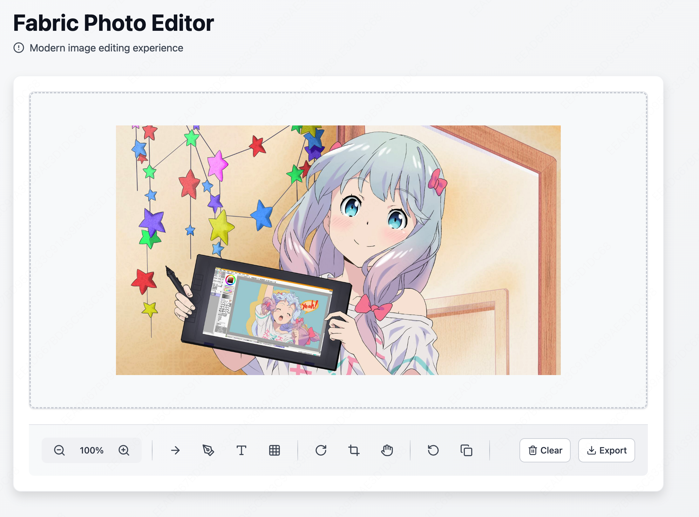

# Fabric Photo

🎨 基于 Canvas 的纯前端图片编辑器，无需后端支持，提供丰富的图片编辑功能。



## ✨ 功能特性

- 🖼️ **基础操作**：图片加载、缩放、拖拽、旋转
- ✏️ **绘图工具**：涂鸦、线条、箭头
- 🔲 **形状绘制**：矩形、圆形、三角形
- 📝 **文本编辑**：添加文字、修改样式
- 🧩 **马赛克**：一键打码保护隐私
- ✂️ **图片裁剪**：自定义裁剪区域
- ↩️ **撤销/重做**：完整的操作历史管理
- 📤 **导出功能**：导出为 PNG/Blob 格式
- 🔍 **鹰眼视图**：缩略图导航

## 📦 安装

```bash
npm install fabric-photo
# 或
pnpm add fabric-photo
```

## 🚀 快速开始

### 基础用法

```html
<!DOCTYPE html>
<html>
<head>
    <meta charset="UTF-8">
    <title>Fabric Photo Demo</title>
</head>
<body>
    <div id="editor" style="width: 800px; height: 600px;"></div>
    
    <script type="module">
        import { FabricPhoto } from 'fabric-photo';
        
        // 创建编辑器实例
        const editor = new FabricPhoto('#editor', {
            cssMaxWidth: 800,
            cssMaxHeight: 600
        });
        
        // 加载图片
        editor.loadImageFromURL('./demo.jpeg', 'demo');
        
        // 监听图片加载完成事件
        editor.on('loadImage', (dimension) => {
            console.log('图片尺寸:', dimension);
        });
    </script>
</body>
</html>
```

### React 中使用

```tsx
import React, { useEffect, useRef } from 'react';
import { FabricPhoto, consts } from 'fabric-photo';

function ImageEditor() {
    const containerRef = useRef<HTMLDivElement>(null);
    const editorRef = useRef<FabricPhoto | null>(null);

    useEffect(() => {
        if (containerRef.current) {
            editorRef.current = new FabricPhoto(containerRef.current, {
                cssMaxWidth: 800,
                cssMaxHeight: 600
            });

            editorRef.current.loadImageFromURL('/images/demo.jpeg', 'demo');

            return () => {
                editorRef.current?.destroy();
            };
        }
    }, []);

    return <div ref={containerRef} style={{ width: 800, height: 600 }} />;
}
```

## 📖 API 文档

### 构造函数

```typescript
new FabricPhoto(element: string | HTMLElement, options?: {
    cssMaxWidth?: number;      // 最大宽度
    cssMaxHeight?: number;     // 最大高度
    selectionStyle?: object;   // 选中样式
});
```

### 图片操作

```typescript
// 从 URL 加载图片
editor.loadImageFromURL(url: string, imageName: string);

// 从文件加载图片
editor.loadImageFromFile(file: File, imageName?: string);

// 获取图片名称
editor.getImageName(): string;
```

### 绘图工具

#### 涂鸦/画笔

```typescript
// 开始涂鸦
editor.startFreeDrawing({
    width: 4,           // 画笔宽度
    color: '#FF3440'    // 画笔颜色
});

// 结束涂鸦
editor.endFreeDrawing();
```

#### 线条

```typescript
// 开始绘制线条
editor.startLineDrawing({
    width: 3,
    color: '#000000'
});

// 结束绘制
editor.endLineDrawing();
```

#### 箭头

```typescript
// 开始绘制箭头
editor.startArrowDrawing({
    width: 4,
    color: '#FF3440'
});

// 结束绘制
editor.endArrowDrawing();
```

#### 马赛克

```typescript
// 开始马赛克
editor.startMosaicDrawing({
    dimensions: 12  // 马赛克块大小
});

// 结束马赛克
editor.endMosaicDrawing();
```

### 形状

```typescript
// 开始形状绘制模式
editor.startDrawingShapeMode();

// 添加矩形
editor.addShape('rect', {
    fill: 'transparent',
    stroke: 'red',
    strokeWidth: 3,
    width: 100,
    height: 100
});

// 添加圆形
editor.addShape('circle', {
    fill: 'blue',
    rx: 50,
    ry: 50
});

// 添加三角形
editor.addShape('triangle', {
    fill: 'green',
    width: 100,
    height: 100
});

// 结束形状绘制模式
editor.endDrawingShapeMode();
```

### 文本

```typescript
// 进入文本模式
editor.startTextMode();

// 添加文本
editor.addText('双击编辑', {
    styles: {
        fill: '#FF3440',
        fontSize: 50,
        fontWeight: 'bold'
    },
    position: {
        x: 100,
        y: 100
    }
});

// 修改文本样式
editor.changeTextStyle({
    fontStyle: 'italic',
    fontSize: 30
});

// 退出文本模式
editor.endTextMode();
```

### 裁剪

```typescript
// 开始裁剪
editor.startCropping();

// 应用裁剪
editor.endCropping(true);

// 取消裁剪
editor.endCropping(false);
```

### 旋转

```typescript
// 旋转指定角度（相对当前角度）
editor.rotate(90);

// 设置绝对角度
editor.setAngle(45);

// 获取当前角度
editor.getAngle();
```

### 缩放与平移

```typescript
// 设置缩放比例
editor.setZoom(1.5);

// 获取当前缩放比例
editor.getZoom();

// 开始平移模式
editor.startPan();

// 结束平移模式
editor.endPan();
```

### 撤销/重做

```typescript
// 撤销
editor.undo();

// 重做
editor.redo();

// 清空撤销栈
editor.clearUndoStack();

// 清空重做栈
editor.clearRedoStack();
```

### 导出

```typescript
// 导出为 DataURL
const dataUrl = editor.toDataURL('image/png');

// 导出为 Blob
const blob = editor.toBlobData('image/png');
```

### 其他操作

```typescript
// 清空所有对象
editor.clearObjects();

// 结束所有编辑模式
editor.endAll();

// 销毁编辑器
editor.destroy();
```

### 事件

```typescript
// 监听事件
editor.on('loadImage', (dimension) => {
    console.log('图片加载完成', dimension);
});

// 一次性监听
editor.once('loadImage', callback);

// 取消监听
editor.off('loadImage', callback);
```

#### 可用事件

| 事件名 | 说明 |
|--------|------|
| `loadImage` | 图片加载完成 |
| `clearImage` | 图片清除 |
| `selectObject` | 选中对象 |
| `activateText` | 激活文本 |
| `pushUndoStack` | 撤销栈更新 |
| `pushRedoStack` | 重做栈更新 |
| `emptyUndoStack` | 撤销栈为空 |
| `emptyRedoStack` | 重做栈为空 |
| `startCropping` | 开始裁剪 |
| `endCropping` | 结束裁剪 |
| `startFreeDrawing` | 开始涂鸦 |
| `endFreeDrawing` | 结束涂鸦 |
| `changeZoom` | 缩放改变 |

### 状态常量

```typescript
import { consts } from 'fabric-photo';

consts.states.NORMAL          // 正常模式
consts.states.FREE_DRAWING    // 涂鸦模式
consts.states.LINE            // 线条模式
consts.states.ARROW           // 箭头模式
consts.states.TEXT            // 文本模式
consts.states.SHAPE           // 形状模式
consts.states.MOSAIC          // 马赛克模式
consts.states.CROP            // 裁剪模式
consts.states.PAN             // 平移模式
```

## 🛠️ 本地开发

```bash
# 克隆项目
git clone https://github.com/ximing/fabric-photo.git

# 安装依赖
pnpm install

# 启动开发服务器
pnpm run dev

# 构建
pnpm run build
```

## 📱 在线演示

访问 [https://ximing.github.io/fabric-photo/](https://ximing.github.io/fabric-photo/) 体验完整功能。

## 🤝 贡献

欢迎提交 Issue 和 Pull Request！

## 📄 License

[MIT](./LICENSE)

## 🙏 致谢

- [Fabric.js](http://fabricjs.com/) - 强大的 Canvas 库
